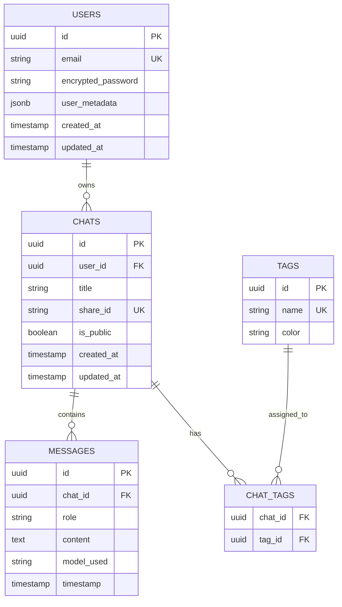
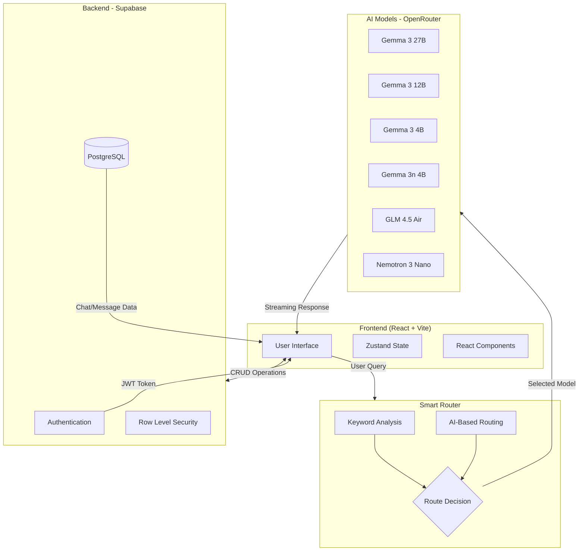

<div align="center">

# MULTIGPT

### *One Interface. Multiple AI Models. Smart Routing.*

[](https://react.dev/)
[](https://www.typescriptlang.org/)
[](https://vite.dev/)
[](https://supabase.com/)
[](LICENSE)
[]()

A modern, multi-model AI chat application that intelligently routes your queries to the best-suited AI model for optimal responses.

</div>

---

## Table of Contents

- [Project Overview](#project-overview)
- [Tech Stack](#tech-stack)
- [Project Structure](#project-structure)
- [ER Diagram](#er-diagram)
- [Architecture Diagram](#architecture-diagram)
- [Output Screenshots](#-output-screenshots)
- [Getting Started](#getting-started)
- [API Documentation](#api-documentation)
- [Features](#features)
- [Contributing Guidelines](#contributing-guidelines)
- [License](#license)

---

## Project Overview

**MULTIGPT** is an intelligent multi-model AI chat interface that allows users to interact with multiple Large Language Models (LLMs) through a single, unified platform.

### What it does
- Provides access to 6 different AI models (Google Gemma, NVIDIA Nemotron, Z-AI GLM)
- Automatically routes queries to the most suitable model based on content analysis
- Maintains persistent chat history with user authentication
- Enables chat organization through tags and search functionality
- Supports sharing conversations via public links

### Problem it solves
- **Model Selection Fatigue**: Users no longer need to manually choose the right AI model for different tasks
- **Fragmented Experience**: Consolidates multiple AI providers into one interface
- **Context Loss**: Persistent chat history ensures conversations are never lost
- **Collaboration**: Share insightful AI conversations with others

### Who it's for
- Developers seeking quick code assistance
- Students needing help with research and writing
- Professionals requiring multilingual support
- Anyone wanting access to multiple AI models without switching platforms

---

## Tech Stack

| Category | Technology | Version | Purpose |
|----------|------------|---------|---------|
| **Frontend** | React | 19.2.0 | UI library for building component-based interfaces |
| **Frontend** | TypeScript | 5.9.3 | Type-safe JavaScript for better developer experience |
| **Build Tool** | Vite | 7.2.4 | Next-generation frontend build tool with HMR |
| **Styling** | Tailwind Merge | 3.4.0 | Utility-first CSS class management |
| **Styling** | Lucide React | 0.563.0 | Modern icon library |
| **State** | Zustand | 5.0.11 | Lightweight state management (available) |
| **Backend** | Supabase | 2.93.3 | PostgreSQL database, authentication, and real-time subscriptions |
| **AI/ML** | OpenRouter API | - | Unified API gateway for multiple LLM providers |
| **Markdown** | React Markdown | 10.1.0 | Render markdown content with custom components |
| **Markdown** | Remark GFM | 4.0.1 | GitHub Flavored Markdown support |
| **Markdown** | Rehype Raw | 7.0.0 | Parse raw HTML in markdown |
| **Code Highlighting** | React Syntax Highlighter | 16.1.0 | Syntax highlighting for code blocks |
| **Analytics** | Vercel Speed Insights | 1.3.1 | Performance monitoring |
| **Linting** | ESLint | 9.39.1 | Code quality and consistency |

---

## Project Structure

```
MULTIGPT/
├── .env.local                # Environment variables (secrets)
├── .env.local.example        # Example environment file
├── .gitignore                # Git ignore rules
├── cspell.json               # Spell checker configuration
├── eslint.config.js          # ESLint configuration
├── index.html                # Entry HTML file
├── output1.png               # Application screenshot 1
├── output2.png               # Application screenshot 2
├── output3.png               # Application screenshot 3
├── package.json              # Dependencies and scripts
├── package-lock.json         # Locked dependency versions
├── README.md                 # Project documentation
├── tsconfig.json             # TypeScript configuration (base)
├── tsconfig.app.json         # TypeScript config for app
├── tsconfig.node.json        # TypeScript config for Node
├── vite.config.ts            # Vite build configuration
│
├── dist/                     # Production build output
├── node_modules/             # Dependencies
├── public/                   # Static assets
│   └── vite.svg              # Vite logo
│
└── src/                      # Source code
    ├── App.tsx               # Main application component
    ├── main.tsx              # Application entry point
    │
    ├── assets/               # Static assets
    │   └── react.svg         # React logo
    │
    ├── components/           # React components
    │   ├── Layout.tsx        # App layout wrapper with sidebar
    │   ├── LoginModal.tsx    # Authentication modal
    │   ├── MarkdownRenderer.tsx  # Markdown rendering component
    │   ├── ModelTabs.tsx     # AI model selection tabs
    │   ├── Sidebar.tsx       # Chat history sidebar
    │   ├── TagManager.tsx    # Chat tagging component
    │   └── UserMenu.tsx      # User profile dropdown
    │
    ├── lib/                  # Utility libraries
    │   ├── openrouter.ts     # OpenRouter API integration
    │   ├── router.ts         # Smart model routing logic
    │   └── supabase.ts       # Supabase client and helpers
    │
    ├── styles/               # CSS styles
    │   └── globals.css       # Global styles and CSS variables
    │
    └── types/                # TypeScript types
        └── index.ts          # Type definitions and model configs
```

### File/Folder Descriptions

| File/Folder | Purpose | Key Responsibilities |
|-------------|---------|---------------------|
| `src/App.tsx` | Main Application | Manages chat state, handles message sending, coordinates all components |
| `src/main.tsx` | Entry Point | Bootstraps React app, initializes Vercel analytics |
| `src/components/Layout.tsx` | Layout Wrapper | Provides app structure with sidebar and main content area |
| `src/components/LoginModal.tsx` | Authentication | Handles user sign-in/sign-up with email and password |
| `src/components/MarkdownRenderer.tsx` | Content Rendering | Renders AI responses with syntax highlighting and formatting |
| `src/components/ModelTabs.tsx` | Model Selection | Displays tabs for selecting AI models including auto-select |
| `src/components/Sidebar.tsx` | Navigation | Shows chat history, search, tagging, and filtering |
| `src/components/TagManager.tsx` | Organization | Manages adding/removing tags from chats |
| `src/components/UserMenu.tsx` | User Profile | Dropdown menu for settings, logout, and user info |
| `src/lib/openrouter.ts` | API Client | Handles streaming API calls to OpenRouter |
| `src/lib/router.ts` | Smart Routing | Analyzes queries and selects optimal AI model |
| `src/lib/supabase.ts` | Database Layer | All database operations (CRUD) and authentication |
| `src/types/index.ts` | Type Definitions | TypeScript interfaces and model configurations |
| `src/styles/globals.css` | Styling | CSS variables, glassmorphism effects, responsive design |

---

## ER Diagram



### Table Descriptions

| Table | Purpose |
|-------|---------|
| **USERS** | Managed by Supabase Auth; stores user credentials and metadata |
| **CHATS** | Stores conversation sessions with titles and sharing options |
| **MESSAGES** | Individual messages within chats with role (user/assistant) and model used |
| **TAGS** | Customizable labels for organizing chats |
| **CHAT_TAGS** | Junction table for many-to-many relationship between chats and tags |

---

## Architecture Diagram



### Request Lifecycle

1. **User Input**: User types a message in the chat input
2. **Model Selection**: If "Auto" is selected, the Smart Router analyzes the query
3. **Keyword Matching**: First attempts keyword-based routing (fastest)
4. **AI Fallback**: If no keywords match, uses a lightweight model to decide
5. **API Call**: Request sent to OpenRouter with selected model
6. **Streaming**: Response streams back in real-time chunks
7. **Persistence**: Message saved to Supabase database
8. **Display**: Markdown rendered with syntax highlighting

---

## 📸 Output Screenshots

### Output 1


### Output 2


### Output 3


---

## Getting Started

### Prerequisites

- **Node.js** >= 18.0.0
- **npm** >= 9.0.0 or **yarn** >= 1.22.0
- **Supabase Account** (free tier available)
- **OpenRouter API Key** (free models available)

### Installation

1. **Clone the repository**
   ```bash
   git clone https://github.com/yourusername/multigpt.git
   cd multigpt
   ```

2. **Install dependencies**
   ```bash
   npm install
   ```

3. **Set up environment variables**
   
   Create a `.env.local` file in the root directory:
   ```env
   # OpenRouter API Key (required)
   # Get yours at: https://openrouter.ai/keys
   VITE_OPENROUTER_API_KEY=your_openrouter_api_key_here

   # Supabase Configuration (required for persistence)
   # Get from: https://supabase.com/dashboard/project/_/settings/api
   VITE_SUPABASE_URL=https://your-project.supabase.co
   VITE_SUPABASE_ANON_KEY=your_supabase_anon_key_here
   ```

4. **Set up Supabase Database**
   
   Run these SQL commands in Supabase SQL Editor:
   ```sql
   -- Create chats table
   CREATE TABLE chats (
     id UUID DEFAULT gen_random_uuid() PRIMARY KEY,
     user_id UUID REFERENCES auth.users(id),
     title TEXT DEFAULT 'New Chat',
     share_id TEXT UNIQUE,
     is_public BOOLEAN DEFAULT false,
     created_at TIMESTAMP WITH TIME ZONE DEFAULT NOW(),
     updated_at TIMESTAMP WITH TIME ZONE DEFAULT NOW()
   );

   -- Create messages table
   CREATE TABLE messages (
     id UUID DEFAULT gen_random_uuid() PRIMARY KEY,
     chat_id UUID REFERENCES chats(id) ON DELETE CASCADE,
     role TEXT CHECK (role IN ('user', 'assistant', 'system')),
     content TEXT,
     model_used TEXT,
     timestamp TIMESTAMP WITH TIME ZONE DEFAULT NOW()
   );

   -- Create tags table
   CREATE TABLE tags (
     id UUID DEFAULT gen_random_uuid() PRIMARY KEY,
     name TEXT UNIQUE NOT NULL,
     color TEXT DEFAULT '#6366f1'
   );

   -- Create chat_tags junction table
   CREATE TABLE chat_tags (
     chat_id UUID REFERENCES chats(id) ON DELETE CASCADE,
     tag_id UUID REFERENCES tags(id) ON DELETE CASCADE,
     PRIMARY KEY (chat_id, tag_id)
   );

   -- Enable Row Level Security
   ALTER TABLE chats ENABLE ROW LEVEL SECURITY;
   ALTER TABLE messages ENABLE ROW LEVEL SECURITY;
   ALTER TABLE tags ENABLE ROW LEVEL SECURITY;
   ALTER TABLE chat_tags ENABLE ROW LEVEL SECURITY;

   -- Create RLS policies
   CREATE POLICY "Users can view own chats" ON chats
     FOR SELECT USING (auth.uid() = user_id OR is_public = true);
   
   CREATE POLICY "Users can insert own chats" ON chats
     FOR INSERT WITH CHECK (auth.uid() = user_id);
   
   CREATE POLICY "Users can update own chats" ON chats
     FOR UPDATE USING (auth.uid() = user_id);
   ```

### Running the Project

**Development Mode**
```bash
npm run dev
```
The app will be available at `http://localhost:5173`

**Production Build**
```bash
npm run build
npm run preview
```

**Linting**
```bash
npm run lint
```

---

## API Documentation

### Internal API Functions

#### OpenRouter Integration

| Function | Parameters | Description | Returns |
|----------|------------|-------------|---------|
| `createChatCompletion` | `messages: Message[]`, `config: ChatConfig`, `onStream?: Function` | Sends chat completion request with streaming | `Promise<string \| void>` |

#### Supabase Functions

| Function | Parameters | Description | Auth Required |
|----------|------------|-------------|---------------|
| `signUp` | `email, password, name` | Create new user account | No |
| `signIn` | `email, password` | Authenticate user | No |
| `signOut` | - | Log out current user | Yes |
| `getCurrentUser` | - | Get authenticated user | No |
| `getChats` | - | Fetch user's chat history | Yes |
| `createChat` | `title` | Create new chat session | Yes |
| `updateChatTitle` | `chatId, title` | Update chat title | Yes |
| `getMessages` | `chatId` | Get messages for a chat | Yes |
| `saveMessage` | `message` | Save new message | Yes |
| `shareChat` | `chatId` | Generate share link | Yes |
| `getSharedChat` | `shareId` | Get public shared chat | No |
| `getTags` | - | Get all tags | Yes |
| `addTagToChat` | `chatId, tagId` | Add tag to chat | Yes |
| `removeTagFromChat` | `chatId, tagId` | Remove tag from chat | Yes |
| `searchChats` | `query` | Search messages content | Yes |

#### Smart Router

| Function | Parameters | Description | Returns |
|----------|------------|-------------|---------|
| `routeQuery` | `query: string` | Analyzes query and selects best model | `Promise<{model, reason}>` |

### AI Models Available

| Model ID | Name | Provider | Best For |
|----------|------|----------|----------|
| `google/gemma-3-27b-it:free` | Gemma 3 27B | Google | Complex analysis, creative writing |
| `google/gemma-3-12b-it:free` | Gemma 3 12B | Google | General purpose tasks |
| `google/gemma-3-4b-it:free` | Gemma 3 4B | Google | Quick responses |
| `google/gemma-3n-e4b-it:free` | Gemma 3n 4B | Google | Efficient/mobile tasks |
| `z-ai/glm-4.5-air:free` | GLM 4.5 Air | Z-AI | Multilingual (Chinese-English) |
| `nvidia/nemotron-3-nano-30b-a3b:free` | Nemotron 3 Nano | NVIDIA | Coding, reasoning |

---

## Features

- **Multi-Model Support** - Access 6 different AI models through one interface
- **Smart Auto-Routing** - Automatically selects the best model for your query
- **Real-time Streaming** - See responses as they're generated
- **Persistent Chat History** - All conversations saved to database
- **User Authentication** - Secure sign-up/sign-in with Supabase Auth
- **Chat Organization** - Tag and filter chats for easy navigation
- **Full-text Search** - Search through message content
- **Chat Sharing** - Generate public links to share conversations
- **Markdown Rendering** - Rich formatting with syntax highlighting
- **Code Copy** - One-click code block copying
- **Response Feedback** - Thumbs up/down for responses
- **Regenerate** - Retry responses with a single click
- **Glassmorphism UI** - Modern, sleek interface design
- **Responsive Design** - Works on desktop and mobile
- **Vercel Analytics** - Built-in performance monitoring

---

## Contributing Guidelines

We welcome contributions! Please follow these steps:

1. **Fork the repository**
2. **Create a feature branch**
   ```bash
   git checkout -b feature/amazing-feature
   ```
3. **Commit your changes**
   ```bash
   git commit -m 'Add amazing feature'
   ```
4. **Push to the branch**
   ```bash
   git push origin feature/amazing-feature
   ```
5. **Open a Pull Request**

### Code Standards

- Follow the existing code style
- Use TypeScript for all new files
- Add appropriate comments for complex logic
- Ensure no linting errors (`npm run lint`)
- Test your changes thoroughly

---

## License

This project is licensed under the MIT License - see the [LICENSE](LICENSE) file for details.

---

<div align="center">

**Built By @heymyselfharsh@gmail.com**

[Report Bug](issues) · [Request Feature](issues)

</div>
